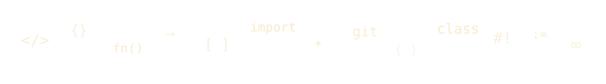
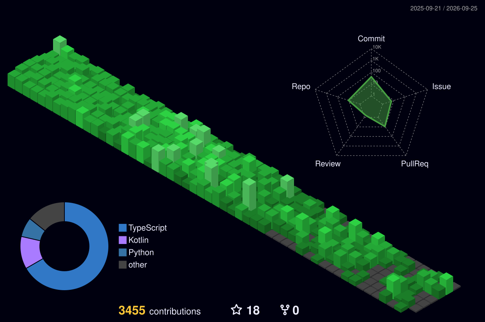

<div align="center">



<a href="https://git.io/typing-svg"></a>

<br/>


</div>

---

<div align="center">

## 🌐 Socials

[](https://www.linkedin.com/in/t-dilan-melvin/)
[](https://instagram.com/dilan_melvin)
[](https://pinterest.com/dilan4524melvin)
[](https://www.quora.com/profile/T-Dilan-Melvin)
[](https://codepen.io/dilanmelvin)
[](https://dilanmelvin.tech)

</div>

---

<div align="center">

## ⚡ At a Glance

</div>

```
🔥 Current Streak       47 days
🏆 Best Streak          47 days
⚡ Max Commits / Day    111
📈 Avg Commits / Day    ~9.80
☁️  Cloud Cost Reduction  80%
🚀 Throughput Gain       40%
🛠️  Open-Source           FastAPI , HeyPuter , twentyhq Contributor
```

---

<div align="center">

## 🐍 Snake eating my contributions

<picture>
  <source media="(prefers-color-scheme: dark)" srcset="https://raw.githubusercontent.com/dilanmelvin/dilanmelvin/output/github-snake-dark.svg" />
  <source media="(prefers-color-scheme: light)" srcset="https://raw.githubusercontent.com/dilanmelvin/dilanmelvin/output/github-snake.svg" />
  
</picture>

</div>

---

<div align="center">

## 📊 GitHub Stats


<br/>

<br/>

<br/>


</div>

---

<div align="center">

## 🏗️ 3D Contribution Calendar



</div>

---

<div align="center">

## 💻 Tech Stack

<br/>


### ⌨️ Languages


<br/><br/>


### 🧠 AI / ML


<br/><br/>


### ⚙️ Backend & APIs


<br/><br/>

### 🗄️ Databases & Storage


<br/><br/>

### 📱 Frontend & Mobile


<br/><br/>

### ☁️ Cloud & DevOps


<br/><br/>


### 🎨 Design


</div>

---

<div align="center">


## 🎖️ Certifications

</div>

| Badge | Issuer | Year |
|:------|:-------|:----:|
| Claude Code in Action | Anthropic | 2026 |
| Oracle Certified Foundations | Oracle | 2026 |
| Associate Software Operator | Redis | 2026 |
| Digital Application Fundamentals | Nasscom | 2026 |
| Cyber Job Simulation | Deloitte | 2025 |
| Open Source Contributor | GitHub × FastAPI | 2025 |

---

<div align="center">


</div>
