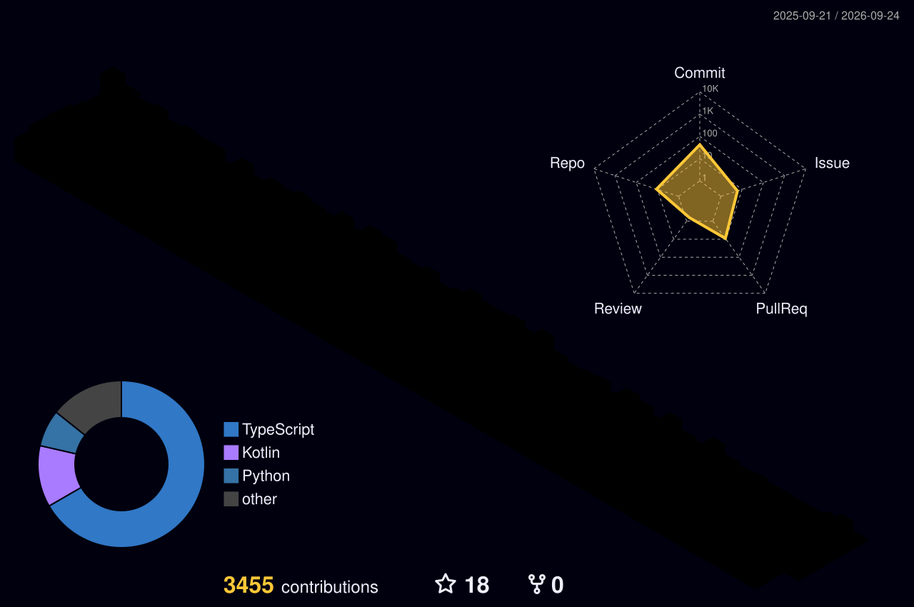

<div align="center">

<svg xmlns="http://www.w3.org/2000/svg" viewBox="0 0 860 120" width="860" height="120">
  <defs>
    <style>
      @keyframes floatA {
        0%, 100% { transform: translateY(0px) rotate(0deg); }
        50% { transform: translateY(-14px) rotate(3deg); }
      }
      @keyframes floatB {
        0%, 100% { transform: translateY(0px) rotate(0deg); }
        50% { transform: translateY(-14px) rotate(-2deg); }
      }
      @keyframes floatC {
        0%, 100% { transform: translateY(0px) rotate(0deg); }
        50% { transform: translateY(-14px) rotate(4deg); }
      }
      .hA { animation: floatA 4s ease-in-out infinite; }
      .hB { animation: floatB 5.2s ease-in-out infinite; }
      .hC { animation: floatC 3.8s ease-in-out infinite; }
    </style>
  </defs>
  <text x="30" y="65" font-family="monospace" font-size="22" fill="#e3b341" opacity="0.22" class="hA" style="animation-delay:0s">&lt;/&gt;</text>
  <text x="100" y="50" font-family="monospace" font-size="20" fill="#e3b341" opacity="0.18" class="hB" style="animation-delay:0.3s">{}</text>
  <text x="160" y="75" font-family="monospace" font-size="18" fill="#e3b341" opacity="0.25" class="hC" style="animation-delay:0.6s">fn()</text>
  <text x="235" y="55" font-family="monospace" font-size="22" fill="#e3b341" opacity="0.15" class="hA" style="animation-delay:0.9s">→</text>
  <text x="290" y="70" font-family="monospace" font-size="20" fill="#e3b341" opacity="0.20" class="hB" style="animation-delay:1.2s">[ ]</text>
  <text x="355" y="45" font-family="monospace" font-size="18" fill="#e3b341" opacity="0.28" class="hC" style="animation-delay:1.5s">import</text>
  <text x="445" y="68" font-family="monospace" font-size="22" fill="#e3b341" opacity="0.17" class="hA" style="animation-delay:1.8s">✦</text>
  <text x="500" y="52" font-family="monospace" font-size="20" fill="#e3b341" opacity="0.23" class="hB" style="animation-delay:2.1s">git</text>
  <text x="560" y="78" font-family="monospace" font-size="18" fill="#e3b341" opacity="0.14" class="hC" style="animation-delay:2.4s">( )</text>
  <text x="620" y="48" font-family="monospace" font-size="20" fill="#e3b341" opacity="0.26" class="hA" style="animation-delay:2.7s">class</text>
  <text x="700" y="62" font-family="monospace" font-size="22" fill="#e3b341" opacity="0.19" class="hB" style="animation-delay:3.0s">#!</text>
  <text x="755" y="55" font-family="monospace" font-size="18" fill="#e3b341" opacity="0.22" class="hC" style="animation-delay:3.3s">:=</text>
  <text x="810" y="72" font-family="monospace" font-size="24" fill="#e3b341" opacity="0.16" class="hA" style="animation-delay:3.6s">∞</text>
</svg>

<a href="https://git.io/typing-svg"></a>

<br/>


</div>

---

<div align="center">

## 🌐 Socials

[](https://www.linkedin.com/in/t-dilan-melvin/)
[](https://instagram.com/dilan_melvin)
[](https://pinterest.com/dilan4524melvin)
[](https://www.quora.com/profile/T-Dilan-Melvin)
[](https://codepen.io/dilanmelvin)
[](https://dilanmelvin.tech)

</div>

---

<div align="center">

## ⚡ At a Glance

</div>

```
🔥 Current Streak       47 days
🏆 Best Streak          47 days
⚡ Max Commits / Day    111
📈 Avg Commits / Day    ~9.80
☁️  Cloud Cost Reduction  80%
🚀 Throughput Gain       40%
🛠️  Open-Source           FastAPI Contributor
```

---

<div align="center">

## 🐍 Snake eating my contributions

<picture>
  <source media="(prefers-color-scheme: dark)" srcset="https://raw.githubusercontent.com/dilanmelvin/dilanmelvin/output/github-snake-dark.svg" />
  <source media="(prefers-color-scheme: light)" srcset="https://raw.githubusercontent.com/dilanmelvin/dilanmelvin/output/github-snake.svg" />
  
</picture>

</div>

---

<div align="center">

## 📊 GitHub Stats


<br/>

<br/>

<br/>


</div>

---

<div align="center">

## 🏗️ 3D Contribution Calendar



</div>

---

<div align="center">

## 💻 Tech Stack

</div>

<div align="center">

<svg xmlns="http://www.w3.org/2000/svg" viewBox="0 0 680 52" width="680" height="52">
  <defs>
    <style>
      @keyframes langA { 0%, 100% { transform: translateY(0px); } 50% { transform: translateY(-10px); } }
      @keyframes langB { 0%, 100% { transform: translateY(0px); } 50% { transform: translateY(-12px); } }
      @keyframes langC { 0%, 100% { transform: translateY(0px); } 50% { transform: translateY(-8px); } }
      .lA { animation: langA 4s ease-in-out infinite; }
      .lB { animation: langB 5.2s ease-in-out infinite; }
      .lC { animation: langC 3.8s ease-in-out infinite; }
    </style>
  </defs>
  <text x="20" y="32" font-size="20" opacity="0.25" class="lA" style="animation-delay:0s">🐍</text>
  <text x="75" y="28" font-size="20" opacity="0.20" class="lB" style="animation-delay:0.3s">🟨</text>
  <text x="130" y="35" font-size="20" opacity="0.28" class="lC" style="animation-delay:0.6s">☕</text>
  <text x="185" y="26" font-size="20" opacity="0.18" class="lA" style="animation-delay:0.9s">🎯</text>
  <text x="240" y="33" font-size="20" opacity="0.22" class="lB" style="animation-delay:1.2s">🎪</text>
  <text x="295" y="30" font-size="20" opacity="0.15" class="lC" style="animation-delay:1.5s">⚡</text>
  <text x="350" y="28" font-size="20" opacity="0.26" class="lA" style="animation-delay:1.8s">🔷</text>
  <text x="405" y="34" font-size="20" opacity="0.19" class="lB" style="animation-delay:2.1s">📜</text>
  <text x="460" y="27" font-size="20" opacity="0.23" class="lC" style="animation-delay:2.4s">🔵</text>
  <text x="515" y="31" font-size="20" opacity="0.17" class="lA" style="animation-delay:2.7s">💠</text>
  <text x="570" y="29" font-size="20" opacity="0.21" class="lB" style="animation-delay:3.0s">📊</text>
  <text x="625" y="33" font-size="20" opacity="0.24" class="lC" style="animation-delay:3.3s">⌨️</text>
</svg>

**Languages**


<br/>

<svg xmlns="http://www.w3.org/2000/svg" viewBox="0 0 680 52" width="680" height="52">
  <defs>
    <style>
      @keyframes mlA { 0%, 100% { transform: translateY(0px); } 50% { transform: translateY(-11px); } }
      @keyframes mlB { 0%, 100% { transform: translateY(0px); } 50% { transform: translateY(-13px); } }
      @keyframes mlC { 0%, 100% { transform: translateY(0px); } 50% { transform: translateY(-9px); } }
      .mA { animation: mlA 4s ease-in-out infinite; }
      .mB { animation: mlB 5.2s ease-in-out infinite; }
      .mC { animation: mlC 3.8s ease-in-out infinite; }
    </style>
  </defs>
  <text x="30" y="32" font-family="serif" font-size="22" fill="#58a6ff" opacity="0.25" class="mA" style="animation-delay:0s">∇</text>
  <text x="100" y="28" font-family="serif" font-size="22" fill="#58a6ff" opacity="0.20" class="mB" style="animation-delay:0.3s">λ</text>
  <text x="170" y="35" font-family="serif" font-size="22" fill="#58a6ff" opacity="0.28" class="mC" style="animation-delay:0.6s">σ</text>
  <text x="240" y="26" font-family="serif" font-size="22" fill="#58a6ff" opacity="0.18" class="mA" style="animation-delay:0.9s">∑</text>
  <text x="310" y="33" font-family="serif" font-size="22" fill="#58a6ff" opacity="0.22" class="mB" style="animation-delay:1.2s">μ</text>
  <text x="380" y="30" font-family="serif" font-size="22" fill="#58a6ff" opacity="0.15" class="mC" style="animation-delay:1.5s">∂</text>
  <text x="450" y="28" font-family="serif" font-size="22" fill="#58a6ff" opacity="0.26" class="mA" style="animation-delay:1.8s">⊕</text>
  <text x="520" y="34" font-family="serif" font-size="22" fill="#58a6ff" opacity="0.19" class="mB" style="animation-delay:2.1s">α</text>
  <text x="580" y="27" font-family="serif" font-size="22" fill="#58a6ff" opacity="0.23" class="mC" style="animation-delay:2.4s">β</text>
  <text x="640" y="31" font-family="serif" font-size="22" fill="#58a6ff" opacity="0.17" class="mA" style="animation-delay:2.7s">θ</text>
</svg>

**AI / ML**


<br/>

<svg xmlns="http://www.w3.org/2000/svg" viewBox="0 0 680 52" width="680" height="52">
  <defs>
    <style>
      @keyframes gearA { 0%, 100% { transform: translateY(0px) rotate(0deg); } 50% { transform: translateY(-8px) rotate(20deg); } }
      @keyframes gearB { 0%, 100% { transform: translateY(0px) rotate(0deg); } 50% { transform: translateY(-10px) rotate(-20deg); } }
      @keyframes gearC { 0%, 100% { transform: translateY(0px) rotate(0deg); } 50% { transform: translateY(-6px) rotate(15deg); } }
      .gA { animation: gearA 4s ease-in-out infinite; }
      .gB { animation: gearB 5.2s ease-in-out infinite; }
      .gC { animation: gearC 3.8s ease-in-out infinite; }
    </style>
  </defs>
  <text x="40" y="32" font-size="20" fill="#f0883e" opacity="0.25" class="gA" style="animation-delay:0s">⚙</text>
  <text x="120" y="28" font-size="20" fill="#f0883e" opacity="0.20" class="gB" style="animation-delay:0.3s">🔧</text>
  <text x="200" y="35" font-size="20" fill="#f0883e" opacity="0.28" class="gC" style="animation-delay:0.6s">⚡</text>
  <text x="280" y="26" font-size="20" fill="#f0883e" opacity="0.18" class="gA" style="animation-delay:0.9s">🛠</text>
  <text x="360" y="33" font-size="20" fill="#f0883e" opacity="0.22" class="gB" style="animation-delay:1.2s">📡</text>
  <text x="440" y="30" font-size="20" fill="#f0883e" opacity="0.15" class="gC" style="animation-delay:1.5s">🔌</text>
  <text x="520" y="28" font-size="20" fill="#f0883e" opacity="0.26" class="gA" style="animation-delay:1.8s">🗄</text>
  <text x="600" y="34" font-size="20" fill="#f0883e" opacity="0.19" class="gB" style="animation-delay:2.1s">🧩</text>
</svg>

**Backend & APIs**


<br/>

**Databases & Storage**


<br/>

**Frontend & Mobile**


<br/>

**Cloud & DevOps**


<br/>

<svg xmlns="http://www.w3.org/2000/svg" viewBox="0 0 680 52" width="680" height="52">
  <defs>
    <style>
      @keyframes desA { 0%, 100% { transform: translateY(0px); } 50% { transform: translateY(-10px); } }
      @keyframes desB { 0%, 100% { transform: translateY(0px); } 50% { transform: translateY(-13px); } }
      @keyframes desC { 0%, 100% { transform: translateY(0px); } 50% { transform: translateY(-8px); } }
      .dA { animation: desA 4s ease-in-out infinite; }
      .dB { animation: desB 5.2s ease-in-out infinite; }
      .dC { animation: desC 3.8s ease-in-out infinite; }
    </style>
  </defs>
  <text x="50" y="32" font-size="20" fill="#a371f7" opacity="0.25" class="dA" style="animation-delay:0s">🎨</text>
  <text x="140" y="28" font-size="20" fill="#a371f7" opacity="0.20" class="dB" style="animation-delay:0.3s">✏️</text>
  <text x="230" y="35" font-size="20" fill="#a371f7" opacity="0.28" class="dC" style="animation-delay:0.6s">🖌</text>
  <text x="320" y="26" font-size="22" fill="#a371f7" opacity="0.18" class="dA" style="animation-delay:0.9s">◈</text>
  <text x="410" y="33" font-size="22" fill="#a371f7" opacity="0.22" class="dB" style="animation-delay:1.2s">✦</text>
  <text x="490" y="30" font-size="22" fill="#a371f7" opacity="0.15" class="dC" style="animation-delay:1.5s">⬡</text>
  <text x="570" y="28" font-size="22" fill="#a371f7" opacity="0.26" class="dA" style="animation-delay:1.8s">◉</text>
</svg>

**Design**


</div>

---

<div align="center">

## 🏆 GitHub Trophies


</div>

---

<div align="center">

<svg xmlns="http://www.w3.org/2000/svg" viewBox="0 0 680 52" width="680" height="52">
  <defs>
    <style>
      @keyframes certA { 0%, 100% { transform: translateY(0px); } 50% { transform: translateY(-10px); } }
      @keyframes certB { 0%, 100% { transform: translateY(0px); } 50% { transform: translateY(-12px); } }
      @keyframes certC { 0%, 100% { transform: translateY(0px); } 50% { transform: translateY(-8px); } }
      .cA { animation: certA 4s ease-in-out infinite; }
      .cB { animation: certB 5.2s ease-in-out infinite; }
      .cC { animation: certC 3.8s ease-in-out infinite; }
    </style>
  </defs>
  <text x="50" y="32" font-size="20" fill="#e3b341" opacity="0.25" class="cA" style="animation-delay:0s">🏅</text>
  <text x="150" y="28" font-size="20" fill="#e3b341" opacity="0.20" class="cB" style="animation-delay:0.3s">⭐</text>
  <text x="250" y="35" font-size="20" fill="#e3b341" opacity="0.28" class="cC" style="animation-delay:0.6s">🎓</text>
  <text x="350" y="26" font-size="20" fill="#e3b341" opacity="0.18" class="cA" style="animation-delay:0.9s">🏆</text>
  <text x="440" y="33" font-size="22" fill="#e3b341" opacity="0.22" class="cB" style="animation-delay:1.2s">✦</text>
  <text x="540" y="30" font-size="20" fill="#e3b341" opacity="0.15" class="cC" style="animation-delay:1.5s">🌟</text>
</svg>

## 🎖️ Certifications

</div>

| Badge | Issuer | Year |
|:------|:-------|:----:|
| Claude Code in Action | Anthropic | 2026 |
| Oracle Certified Foundations | Oracle | 2026 |
| Associate Software Operator | Redis | 2026 |
| Digital Application Fundamentals | Nasscom | 2026 |
| Cyber Job Simulation | Deloitte | 2025 |
| Open Source Contributor | GitHub × FastAPI | 2025 |

---

<div align="center">

<svg xmlns="http://www.w3.org/2000/svg" viewBox="0 0 760 56" width="760" height="56">
  <defs>
    <style>
      @keyframes waveA { 0%, 100% { transform: translateY(0px); } 50% { transform: translateY(-12px); } }
      @keyframes waveB { 0%, 100% { transform: translateY(0px); } 50% { transform: translateY(-14px); } }
      @keyframes waveC { 0%, 100% { transform: translateY(0px); } 50% { transform: translateY(-10px); } }
      .wA { animation: waveA 4s ease-in-out infinite; }
      .wB { animation: waveB 5.2s ease-in-out infinite; }
      .wC { animation: waveC 3.8s ease-in-out infinite; }
    </style>
  </defs>
  <text x="20" y="35" font-family="monospace" font-size="20" fill="#e3b341" opacity="0.22" class="wA" style="animation-delay:0s">&lt;</text>
  <text x="80" y="30" font-family="monospace" font-size="20" fill="#e3b341" opacity="0.18" class="wB" style="animation-delay:0.3s">/</text>
  <text x="140" y="38" font-family="monospace" font-size="18" fill="#e3b341" opacity="0.25" class="wC" style="animation-delay:0.6s">fn</text>
  <text x="200" y="28" font-family="monospace" font-size="20" fill="#e3b341" opacity="0.15" class="wA" style="animation-delay:0.9s">{}</text>
  <text x="270" y="35" font-family="monospace" font-size="22" fill="#e3b341" opacity="0.20" class="wB" style="animation-delay:1.2s">→</text>
  <text x="340" y="32" font-family="monospace" font-size="22" fill="#e3b341" opacity="0.28" class="wC" style="animation-delay:1.5s">∞</text>
  <text x="410" y="30" font-family="monospace" font-size="20" fill="#e3b341" opacity="0.17" class="wA" style="animation-delay:1.8s">[]</text>
  <text x="470" y="36" font-family="serif" font-size="22" fill="#e3b341" opacity="0.23" class="wB" style="animation-delay:2.1s">λ</text>
  <text x="530" y="28" font-family="monospace" font-size="20" fill="#e3b341" opacity="0.14" class="wC" style="animation-delay:2.4s">()</text>
  <text x="590" y="34" font-family="monospace" font-size="20" fill="#e3b341" opacity="0.26" class="wA" style="animation-delay:2.7s">⚙</text>
  <text x="650" y="30" font-family="monospace" font-size="20" fill="#e3b341" opacity="0.19" class="wB" style="animation-delay:3.0s">#</text>
  <text x="710" y="35" font-family="monospace" font-size="20" fill="#e3b341" opacity="0.22" class="wC" style="animation-delay:3.3s">&gt;</text>
</svg>


</div>
